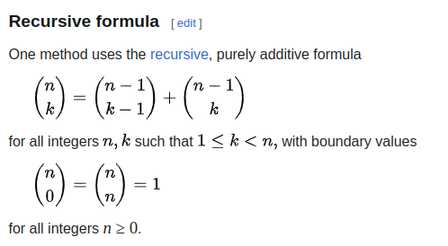

# C++ Programming - Handout 2

Konrad Wojda, 9307820244

## Exercise 1

According to: https://en.wikipedia.org/wiki/Binomial_coefficient#Recursive_formula  
There is a recursive formula for binomial coefficient:



Let's use it to write function in C++.

### 1) Function for computinh binomial coefficient.
```cpp
unsigned long long binomialCoefficient(int n, int r) {
    if (r == 0 || r == n) {
        return 1;
    }

    return binomialCoefficient(n - 1, r - 1) + binomialCoefficient(n - 1, r);
}
```

### 2) Embed function into small program

```cpp
#include <iostream>

unsigned long long binomialCoefficient(int n, int r) {
    if (r == 0 || r == n) {
        return 1;
    }

    return binomialCoefficient(n - 1, r - 1) + binomialCoefficient(n - 1, r);
}

int main() {
    int n, r;

    std::cout << "Enter two integers (n and r) for calculating binomial coefficient:" << std::endl;
    std::cin >> n >> r;

    unsigned long long result = binomialCoefficient(n, r);
    std::cout << "C(" << n << ", " << r << ") = " << result << std::endl;

    return 0;
}
```

#### Sample output:

```bash
konradwojda@konradwojda-comp:~/studia/cpp-hyu/02-hw$ ./a.out 
Enter two integers (n and r) for calculating binomial coefficient:
5
0
C(5, 0) = 1
konradwojda@konradwojda-comp:~/studia/cpp-hyu/02-hw$ ./a.out 
Enter two integers (n and r) for calculating binomial coefficient:
4
4
C(4, 4) = 1
konradwojda@konradwojda-comp:~/studia/cpp-hyu/02-hw$ ./a.out 
Enter two integers (n and r) for calculating binomial coefficient:
5
2
C(5, 2) = 10
```

## Exercise 2

Let's use `std::vector` and `std::next_permutation` to create `permutNumbers` function. Reference: https://en.cppreference.com/w/cpp/algorithm/next_permutation  

```cpp
#include <iostream>
#include <vector>
#include <algorithm>

void permutNumbers(int n) {
    std::vector<int> numbers;
    for (int i = 1; i <= n; ++i) {
        numbers.push_back(i);
    }

    do {
        for (int num : numbers) {
            std::cout << num;
        }
        std::cout << ", ";
    } while (std::next_permutation(numbers.begin(), numbers.end()));

    std::cout << std::endl;
}

int main() {
    permutNumbers(3);
}
```

#### Sample output

```bash
konradwojda@konradwojda-comp:~/studia/cpp-hyu/02-hw$ ./a.out 
123, 132, 213, 231, 312, 321, 
```

## Exercise 3

### Given function

```cpp
int sum_down(int x)
{
	if (x >= 0)
	{
		x = x - 1;
		int y = x + sum_down(x);
		return y + sum_down(x);
	}
	else
	{
		return 1;
	}
}
```

Let's simplify this function:

```cpp
int sum_down(int x)
{
    if (x < 0) {
        return 1;
    }
    return (x-1) + 2 * sum_down(x-1);
}
```

#### 3a

Let's write simple test to check what is the smallest integer, so that function returns value greates than 1.000.000:

```cpp
int main() {
    int x = 0;
    while (sum_down(x) <= 1000000) {
        x++;
    }

    std::cout << x;   
}
```

```bash
konradwojda@konradwojda-comp:~/studia/cpp-hyu/02-hw$ ./a.out 
19
```

So the answer is **19**.

#### 3b

Let's use simplified function with only one recursive call. Result is:

```cpp
int sum_down_iterative(int x) {
    int result = 1;
    for (int i = 0; i <= x; i++) {
        result = (i - 1) + 2 * result;
    }
    return result;
}
```

Let's test it with some simple assertion:

```cpp
int main() {
    int x = 0;
    for(int i = 0; i < 100; i++) {
        assert(sum_down(i) == sum_down_iterative(i));
    }
    
}
```

There was no error, so iterative verion is giving same results as recursive.

#### 3c

**No**, because:

It would not be appropriate to switch the type of `x` to `double` because the recursion (or iteration) operates on integer values (it decrements `x` and checks if `x >= 0`). If `x` were a double, there would be issues related to precision, and the logic for checking when `x` is negative would become unreliable due to floating-point precision errors.  
Additionally, the operation `x = x - 1` would make no sense for non-integer values, and rounding issues might occur.  

#### 3d

**No**, because:  
Using `unsigned int` would prevent the function from handling negative values, which are crucial for the base case (`x<0`). If `x` were `unsigned int`, the function would never terminate when `x` is initially 0 or greater, leading to infinite recursion or looping because an unsigned integer can never be negative.

#### 3e

**No**, because:  
Using `const int x` would prevent the function from modifying `x` inside the function. In the original recursive version, `x` is being decremented as part of the computation (`x = x - 1`).
If the parameter were `const`, the function would no longer be able to modify `x`, which is critical to the recursive or iterative logic.
